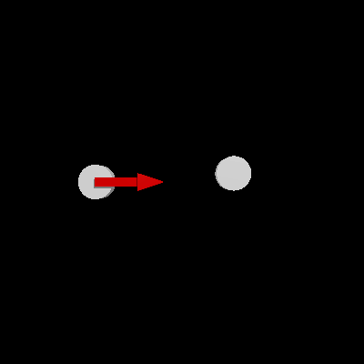
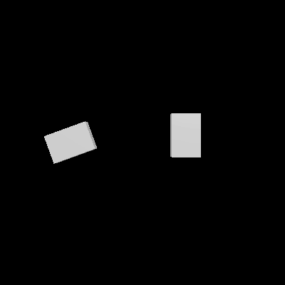
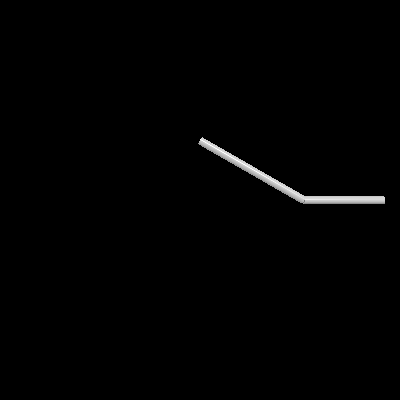
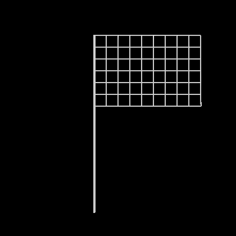
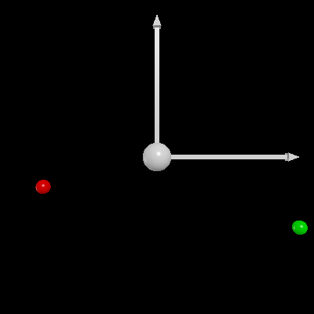
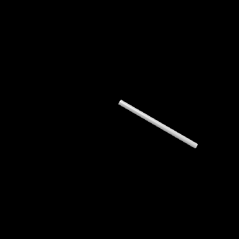
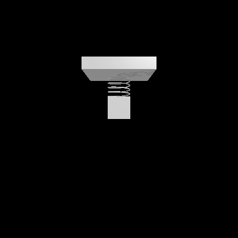

# physics-simulations
Playground for simple physics simulations.

## Requirements
```
$ pip install -r requirements.txt
```
- [vpython](https://vpython.org/) (7.5.0)       - VPython for Jupyter Notebook
- sympy                           (1.4)

Animations created thanks to:
- povexport script from [vpython-jupyter](https://github.com/BruceSherwood/vpython-jupyter)
- [povray](http://povray.org/)
- [FFmpeg](https://www.ffmpeg.org/)

## Gallery
   
   
